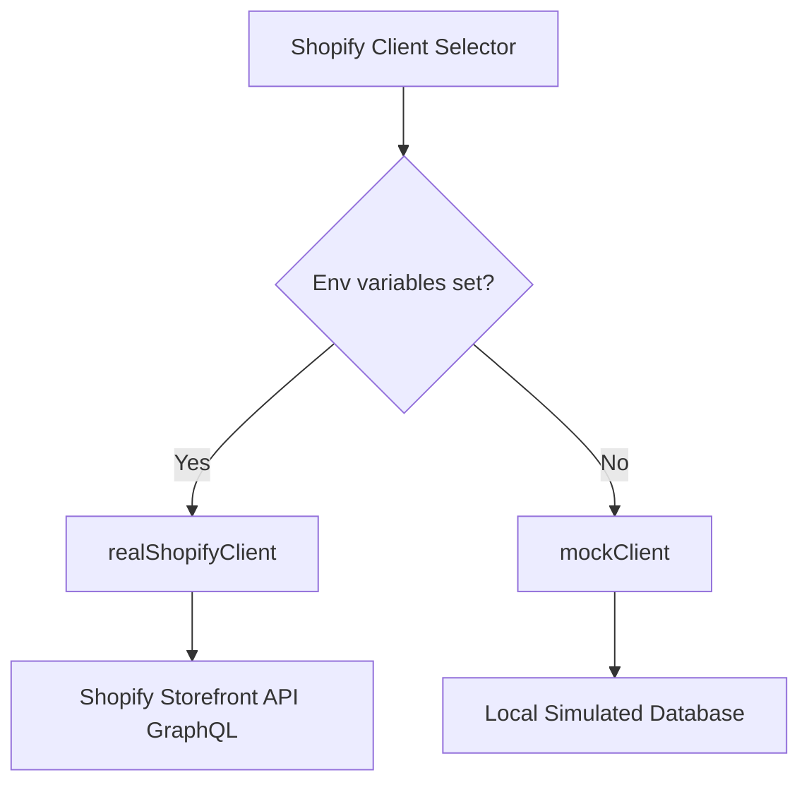
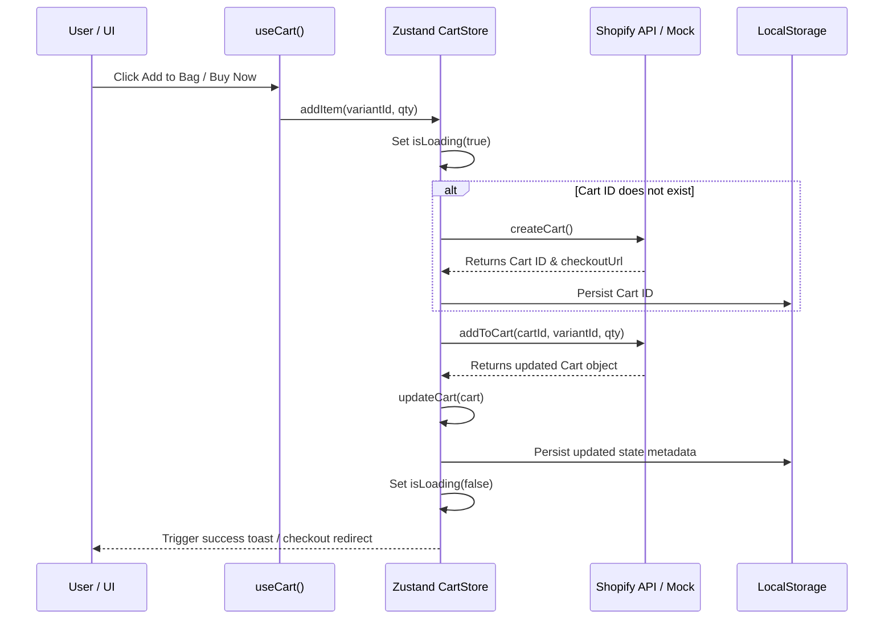
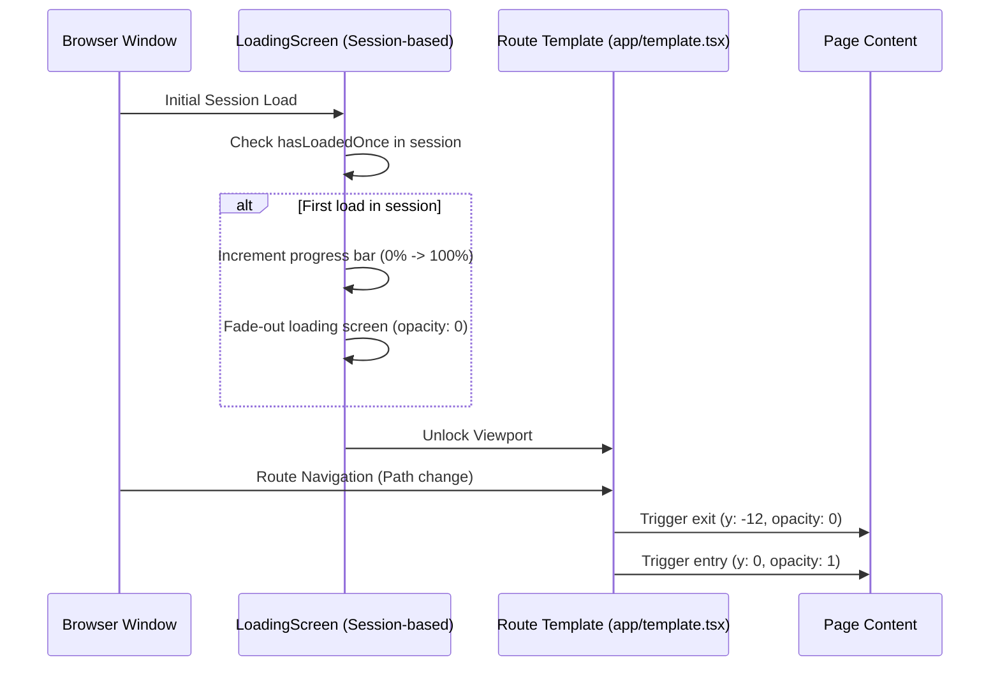

# Maison Écorce — Headless Luxury Storefront

> An editorial-brutalist, couture-grade headless e-commerce storefront for fine leather footwear and bags, connected directly to the Shopify Storefront API.

[](https://nextjs.org/)
[](https://tailwindcss.com/)
[](https://github.com/pmndrs/zustand)
[](https://shopify.dev/docs/api/storefront)

---

## ✦ Brand Vision & Concept

Maison Écorce rejects generic modern e-commerce structures. Instead, it presents an **Editorial Brutalist / High-End Fashion Print** lookbook style. The visual architecture mimics premium print layout booklets, emphasizing clean structure, raw grids, and tactile typography.

### Core Visual Guidelines:
1. **Zero Rounded Corners**: All components (buttons, cards, images, inputs, and drawers) use sharp corners (`--radius: 0px` globally).
2. **High-Contrast Palette**: The interface uses a stark plaster background (`#F5F3EE`) with deep slate ink lines (`#1A1917`), swapping dynamically in dark mode.
3. **Couture Typography**: Editorial serif headings (Playfair Display) contrasted with monospace metadata for items.
4. **Structured Grids**: Sections are explicitly demarcated by solid ink borders rather than drop shadows.
5. **Tactile Hover Translations**: Interactive elements translate on hover with a brutalist offset shadow (`shadow-brutal` active offset transitions).

---

## ⚙️ Systems Architecture

Maison Écorce operates as a fully decoupled client-side web application. It integrates custom state stores with local persistence and Shopify API endpoints.

### 1. Dual-Client Adapter Pattern
To ensure the storefront can be previewed offline or in sandbox testing, a dual-client adapter selects the appropriate client dynamically based on environment variables.



### 2. Zustand Cart & Shopify Storefront API Sync
The cart system is persisted to localStorage and updates asynchronously with Shopify's GraphQL Cart mutations.



### 3. Zustand Favorites Store Lifecycle
A persistent, lightweight client-side favorites system.

```mermaid
graph LR
    UI[ProductCard / PDP Heart Icon] -->|Click| Store[Zustand FavoritesStore]
    Store -->|Toggle product| State{In favorites array?}
    State -- Yes -->|Remove| NewState[Filter item out]
    State -- No -->|Add| NewState[Append item]
    NewState -->|Write| DB[LocalStorage]
    NewState -->|Reactive Selection| UI
```

### 4. Dynamic Bilingual Translation Flow
All UI strings are dynamically translated using a custom dictionary helper.

```mermaid
graph TD
    User[Toggle Language] -->|locale updated| Store[Zustand CartStore]
    Store -->|locale: 'fr' or 'en'| Hook[Components / UI]
    Hook -->|t('key', locale)| Dict[copy-dict.ts]
    Dict -->|Look up DICTIONARY[key]| UI[Render translated text]
```

### 5. Loading & Route Transitions Lifecycle
Initial progress-based loading and Next.js layout templates combine to orchestrate entry and navigation transitions.



---

## 🛠️ Tech Stack

* **Core Framework**: [Next.js 15](https://nextjs.org/) (App Router, Server Components, dynamic SEO metadata, and layouts).
* **Styling**: [Tailwind CSS v3](https://tailwindcss.com/) (Arbitrary grids and custom offset-brutal animations).
* **State Management**: [Zustand v5](https://github.com/pmndrs/zustand) (Persistent local storage for carts and favorites).
* **Data Fetching**: [TanStack Query v5](https://tanstack.com/query/latest) (Client-side sync, cache invalidation, and query loading).
* **Animations**: [Framer Motion](https://www.framer.com/motion/) (Loader screen transitions and route navigation overlays).
* **Scrolling**: [Lenis](https://lenis.darkroom.engineering/) (Soft physics-based smooth scrolling).
* **Validation**: [Zod](https://zod.dev/) (Strict type-safety parsing for mock and live GraphQL data payloads).

---

## 📂 Project Structure

```
shopifystorev1/
├── app/                      # Next.js 15 Page Routes
│   ├── about/                # Brand heritage page (Server-rendered)
│   ├── favorites/            # Custom Favorites catalog (Client-side)
│   ├── policies/             # Legal notices & terms (Server-rendered)
│   ├── products/             # Main catalog overview & Filters
│   │   ├── [handle]/         # Dynamic Product Details page (PDP)
│   ├── layout.tsx            # Global wrappers (Lenis, Providers)
│   ├── template.tsx          # Route navigation transition layout
│   └── page.tsx              # Interactive editorial homepage
├── components/               # Reusable React UI Components
│   ├── home/                 # Hero grids, bestseller carousels, reviews
│   ├── layout/               # Nav header, footer, drawers, notifications
│   ├── product/              # Image galleries, variant selectors, accordions
│   └── ui/                   # Modular shadcn/ui components
├── hooks/                    # Custom React hooks (useCart, useLenis)
├── lib/                      # Core utility functions & bilingual dictionary
│   └── shopify/              # Dual GraphQL client adapters
├── store/                    # Zustand stores (Cart, Favorites, Loader)
└── types/                    # TypeScript definitions for Shopify resources
```

---

## ⚙️ Configuration & Environment Setup

To run the application connected to a live Shopify store, create a `.env.local` file in the root folder with the following variables:

| Variable | Description | Example |
| :--- | :--- | :--- |
| `NEXT_PUBLIC_SHOPIFY_STORE_DOMAIN` | Public Shopify domain address | `maison-ecorce.myshopify.com` |
| `NEXT_PUBLIC_SHOPIFY_STOREFRONT_ACCESS_TOKEN` | Public Storefront API token | `ab12c345def678gh90ij12kl34mn56op` |
| `SHOPIFY_STORE_DOMAIN` | Server-side Shopify domain | `maison-ecorce.myshopify.com` |
| `SHOPIFY_STOREFRONT_ACCESS_TOKEN` | Server-side access token | `ab12c345def678gh90ij12kl34mn56op` |

---

## 🚀 Installation & Quick Start

1. **Install Dependencies**:
   ```bash
   npm install
   ```

2. **Start Dev Server**:
   ```bash
   npm run dev
   ```
   Open `http://localhost:3000` in your browser.

3. **Build Production Bundle**:
   ```bash
   npm run build
   ```

4. **Run Production Server**:
   ```bash
   npm run start
   ```

---

## ✍️ Legal Review

The documents inside the `/policies` route are templates for showcase purposes. Prior to deploying a live shopfront, all copy should be reviewed and customized according to local commercial guidelines.
